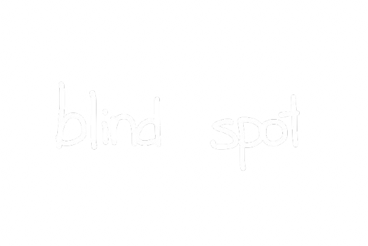
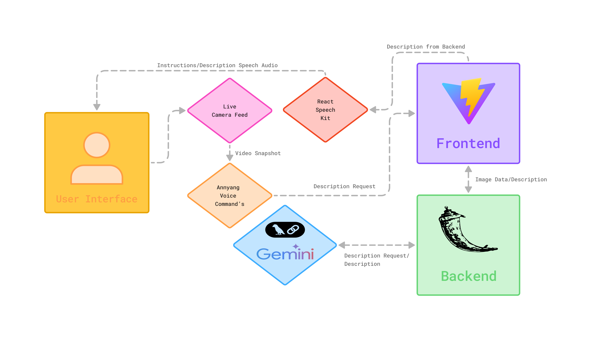

<a name="readme-top"></a>

<div align="center">
  
  <h1>AI-Powered World Description App</h1>
</div> <br>

<details open>
<summary>Table of Contents</summary>
<ol>
  <li>
    <a href="#introduction">Introduction</a>
  </li>
  <li>
    <a href="#features">Features</a>
    <ul>
      <li>
        <a href="#built-with">Built With</a>
      </li>
    </ul>
  </li>
  <li>
    <a href="#getting-started">Getting Started</a>
    <ul>
      <li><a href="#prerequisites">Prerequisites</a></li>
      <li><a href="#setup">Setup</a></li>
    </ul>
  </li>
  <li><a href="#demo">Demo</a></li>
  <li><a href="#contributing">Contributing</a></li>
  <li><a href="#license">License</a></li>
</ol>
</details>

## Introduction
The AI World Description App is designed to provide users with real-time descriptions of their surroundings through a live camera feed. This app leverages cutting-edge AI technologies to enhance accessibility and understanding of the environment.

### Model Workflow
<div align="center">
  
</div> <br>
<p align="right"><a href="#readme-top">Back to top</a></p>

## Features
* **Speech-Activated Image Capture:** Users can activate the app with a simple voice command to take a snapshot of the live camera feed.

* **AI-Powered Image Description:** The app uses an AI agent to analyze the captured image and generate a description of the scene.

* **Text-to-Speech Output:** The generated description is converted into speech, allowing users to hear the information audibly.

### Built With
[![HTML][HTML]][HTML-url]
[![CSS][CSS]][CSS-url]
[![Javascript][Javascript]][Javascript-url]
[![React][React]][React-url]
[![Vite][Vite]][Vite-url]
[![Python][Python]][Python-url]
[![Google Gemini][Gemini]][Gemini-url]
[![Flask][Flask]][Flask-url]

<p align="right"><a href="#readme-top">Back to top</a></p>


## Getting Started
To get a local copy of Blind Spot up and running locally follow these steps:  

### Prerequisites
1. Make sure you have Python installed and use Python3 version 3.12   
**NOTE:** You can check if Python is installed and its version with 
    ```sh
    python -V | python --version
    ```
2. Make sure you have Git installed  
**NOTE:** You can check if Git is installed and its version with
    ```sh
    git -v | git --version
    ```

### Setup
1. Navigate to the directory where you want to clone/run/save the application:
    ```sh
    cd example_directory
    ```
2. Clone the repository:
    ```sh
    git clone https://github.com/Dewiin/blind-spot.git
    ```
3. Navigate to the project directory:
    ```sh
    cd blind-spot
    ```
4. First, download the dependencies in package.json:
    ```sh
    npm install
    ```
4. Next, create a Python virtual environment in the cloned project directory:
    ```sh
    python3.12 -m venv .venv
    ```
5. Activate the virtual environment (Windows OR Mac/Linux):
    1. Windows
        ```sh
          .\.venv\Scripts\activate
        ```
    2. Mac/Linux
        ```sh
          source .venv/bin/activate
        ```
6. Install the python dependencies:
    ```sh
    pip install -r requirements.txt
    ```
7. Set up a Gemini API key:
    - Inside the root directory, create a ``.env`` file. Inside the ``.env`` file, write:
        ```sh
        GOOGLE_API_KEY = "your-api-key"
        ```
    - Replace ``your-api-key`` with your Gemini API key (keep the quotations).

### Usage
1. Run the application:
    ```sh
    # activate backend server
    python src/backend/server.py
    ```
    ```sh
    # run application
    npm run dev
    ```
2. Voice Commands:
    - "Describe the scene."
    - "What's happening."
    - "Guide me."
    - "Show me my blind spot."

<p align="right"><a href="#readme-top">Back to top</a></p>


## Demo
<div align="center">
  
</div>

<p align="right"><a href="#readme-top">Back to top</a></p>


## Contributing
We like open-source and want to develop practical applications for real-world problems. However, individual strength is limited. So, any kinds of contribution is welcome, such as:
- New features
- New models (your fine-tuned models)
- Bug fixes
- Typo fixes
- Suggestions
- Maintenance
- Documents
- etc.

#### Heres how you can contribute:
1. Fork the repository
2. Create a new feature branch
3. Commit your changes 
4. Push to the branch 
5. Submit a pull request

<p align="right"><a href="#readme-top">Back to top</a></p>


## License
MIT License

Copyright (c) 2025 Devin

Permission is hereby granted, free of charge, to any person obtaining a copy
of this software and associated documentation files (the "Software"), to deal
in the Software without restriction, including without limitation the rights
to use, copy, modify, merge, publish, distribute, sublicense, and/or sell
copies of the Software, and to permit persons to whom the Software is
furnished to do so, subject to the following conditions:

The above copyright notice and this permission notice shall be included in all
copies or substantial portions of the Software.

THE SOFTWARE IS PROVIDED "AS IS", WITHOUT WARRANTY OF ANY KIND, EXPRESS OR
IMPLIED, INCLUDING BUT NOT LIMITED TO THE WARRANTIES OF MERCHANTABILITY,
FITNESS FOR A PARTICULAR PURPOSE AND NONINFRINGEMENT. IN NO EVENT SHALL THE
AUTHORS OR COPYRIGHT HOLDERS BE LIABLE FOR ANY CLAIM, DAMAGES OR OTHER
LIABILITY, WHETHER IN AN ACTION OF CONTRACT, TORT OR OTHERWISE, ARISING FROM,
OUT OF OR IN CONNECTION WITH THE SOFTWARE OR THE USE OR OTHER DEALINGS IN THE
SOFTWARE.


[HTML]: https://img.shields.io/badge/HTML-%23E34F26.svg?style=for-the-badge&logo=html5&logoColor=white
[HTML-url]: https://html.spec.whatwg.org/multipage/

[CSS]: https://img.shields.io/badge/CSS-1572B6?style=for-the-badge&logo=css3&logoColor=fff
[CSS-url]: https://www.w3.org/Style/CSS/Overview.en.html

[Javascript]: https://img.shields.io/badge/JavaScript-F7DF1E?style=for-the-badge&logo=javascript&logoColor=000
[Javascript-url]: https://262.ecma-international.org/14.0/

[React]: https://img.shields.io/badge/React-%2320232a.svg?style=for-the-badge&logo=react&logoColor=%2361DAFB
[React-url]: https://react.dev/

[Vite]: https://img.shields.io/badge/Vite-646CFF?style=for-the-badge&logo=vite&logoColor=fff
[Vite-url]: https://vite.dev/

[Python]: https://img.shields.io/badge/python-FFDE57?style=for-the-badge&logo=python&logoColor=4584B6
[Python-url]: https://www.python.org/

[Gemini]: https://img.shields.io/badge/Google%20Gemini-886FBF?style=for-the-badge&logo=googlegemini&logoColor=fff
[Gemini-url]: https://gemini.google.com/app

[Flask]: https://img.shields.io/badge/Flask-000?style=for-the-badge&logo=flask&logoColor=fff
[Flask-url]: https://flask.palletsprojects.com/en/stable/
